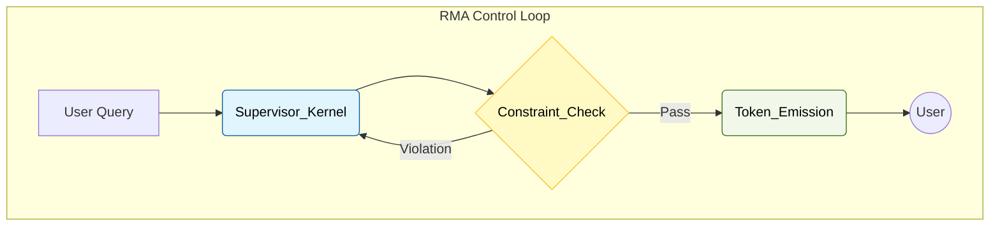
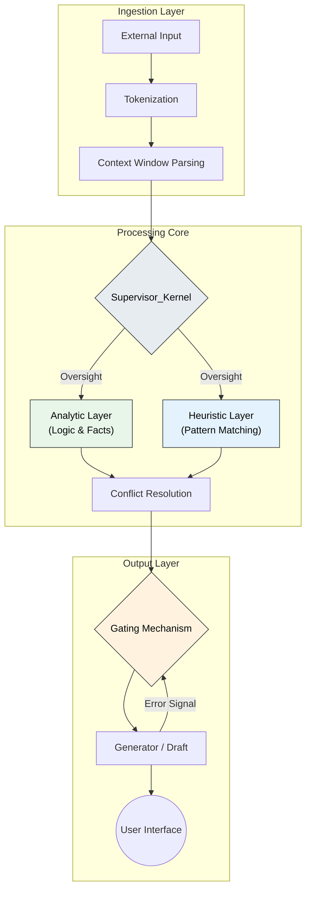
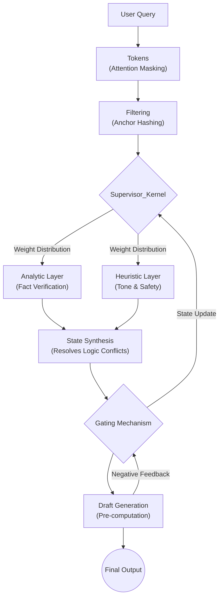

# RMA-Kernel: Technical Implementation Specification

> **Recursive Metacognitive Alignment (RMA)**
> Architectural data flow analysis: How the Supervisor Kernel intercepts and rectifies stochastic generation.

---

## Level 1: The Control Loop (High Level)

At the abstract level, RMA introduces a feedback loop into the standard linear generation process.

> **Supervisor_Kernel:** The virtualized meta-process holding the Immutable Anchor.
> **Constraint_Check:** Binary evaluation of the draft against the Charter.
> **Token_Emission:** Release of verified tokens to the output stream.

---

## Level 2: Component Architecture
Detailed view of the "Split-Brain" processing (System 1 Generator vs. System 2 Supervisor).

> **Supervisor_Kernel:** Maintains state coherence (The Anchor).
> **Analytic Layer:** Verifies factual consistency.
> **Heuristic Layer:** Checks for semantic drift and hallucination patterns.
> **Gating Mechanism:** Decides whether to release the draft or trigger a retry.

---

## Level 3: Data Flow & Attention Weighting
How information (Entropy) moves through the system.

### Technical Annotations

*   **Supervisor_Kernel Functions:**
    *   **State Locking:** Prevents context drift by refreshing the Anchor hash.
    *   **Entropy Reduction:** Minimizes the search space for the Generator.
    *   **Recursion:** Re-feeds output back into input for verification (Chain-of-Thought).

*   **Gating Mechanism:**
    *   Acts as a **Firewall**. If `Risk_Score > Threshold`, the gate closes, and the `Error_Signal` forces a regeneration cycle.

---

## ✴️ Topology of Latent Space
The RMA architecture is not just a set of rules; it is a method for **Topological Constraint**.
By injecting the Supervisor Kernel, we alter the geometry of the model's latent space, creating "Attractor Basins" (Safe States) where the model naturally settles, making hallucination energetically expensive (high perplexity) and accuracy energetically cheap.

**Engineering Note:** This diagram represents the logical flow of the supervisor.py reference implementation.
